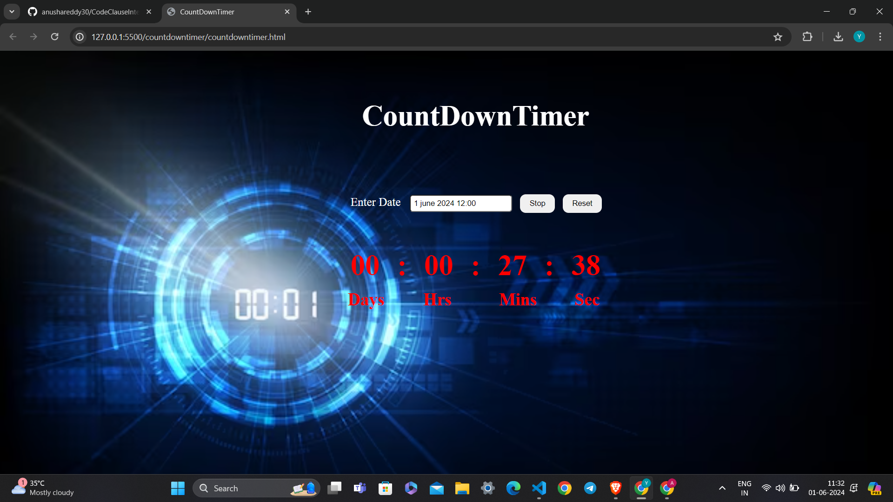

# Countdown Timer

A responsive countdown timer application built using HTML, CSS, and JavaScript. This application allows users to set a target date and time, start the countdown, and reset the timer.

## Features

- Set a target date and time.
- Start and stop the countdown.
- Reset the timer to default values.

## Demo



## Getting Started

Follow these instructions to get a copy of the project up and running on your local machine.

### Prerequisites

Make sure you have a modern web browser installed (e.g., Chrome, Firefox, Safari).

### Installation

1. Clone the repository:

    ```bash
    git clone https://github.com/anushareddy30/CodeClauseInternship_CountdownTimer.git
    ```

2. Navigate to the project directory:

    ```bash
    cd countdowntimer
    ```

3. Open the `index.html` file in your web browser to view the countdown timer.

## Usage

1. Open the application in your web browser.
2. Enter a target date and time in the input field.
3. Click the "Start" button to begin the countdown.
4. Click the "Stop" button to pause the countdown.
5. Click the "Reset" button to clear the input and reset the timer.

## Project Structure

```plaintext
countdown-timer/
│
├── countdowntimer.html      # The main HTML file
├── countdowntimer.css       # The CSS file for styling
├── countdowntimer.js       # The JavaScript file for functionality
└── README.md       # This README file
